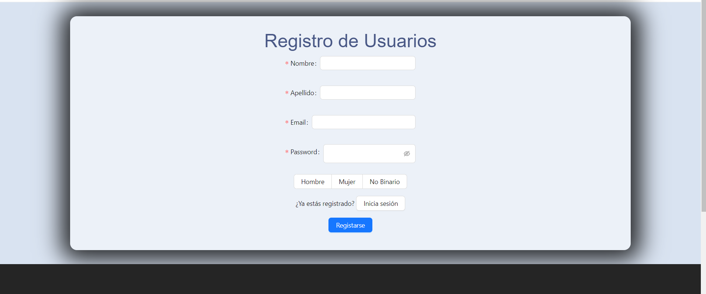

#  React Ecommerce Tienda Expo Verde

## Index

* About the project:
    * Installation and deployment
    * Technologies used
    * Origin
    * Objectives
    * Challenges presented
    * Authors

## About the project

In this ocassion we present an e-commerce shop of plants and decoration articles in React with a Sequelize backend. You can register in the web page, login and logout.Once you´re loged in you can add products to the cart and buy them. You can also add your favourite products, check the logged user information and order history. 

### 💫 Installation and deployment

To download the repository, in Visual Studio, open a terminal and run the following command:


Ecommerce frontend:
```
$ git clone https://github.com/msalvatore82/Expo-verde-Tienda-online-Front.git
```
Ecommerce backend:
```
$ git clone https://github.com/msalvatore82/Expo-verde-Tienda-online-Back.git
```

 Next, you will need to download the external modules. To do this, perform the following command:

```
$ npm i
```

Then, start the React frontend as well as the Sequelize backend via:

```
$ npm start
```
It will be necessary if you run the database that you make use of the following series of commands:

Modify the database, inside config/config.example.json so that you can use the project.
```
"development": {
      "username": "Your user", 
      "password": "Your password",
      "database": "Your database's name",
      "host": "Your host",
      "dialect": "mysql",
      "jwt_secret": "Your jwt password"
```

```
sequelize db:create

sequelize db:migrate

sequelize db:seed:all
```

Now you will be able to navigate through the frontend loading all backend products.

### 💻 Technologies used

* HTML
* CSS
* Sass
* Javascript
* React
* React-GlobalContext
* React-Router
* Sequelize 
* NodeJS 
* Axios 
* Bootstrap
* Ant-Design 

### Origin

This project is intended as an exercise in The Bridge that allows us to put into practice our newly acquired knowledge of React, specifically using React Router and Sass. In the same way we take advantage of a previous Backend project with Sequelize, which will necessarily have to undergo modifications to adapt to the new project. 

### ⚔️ Objectives

Create a REST API that is capable of the following:
* A React mini-project to practice all the basic elements of React already seen.
* User registration.
* User login.
* To be able to see the products and add them to the shopping cart.
* Capable to create orders.
* See your data at your profile.

#### ⚔️ Minimum components:
* Register
* Login
* Home
* Products
* Product
* Profile. Profile view with the logged data user and his orders.
* Header
* Footer

Implementation of React Router on your page
* /home. Home of the app
/login
/register
/profile. 
Use Context 

#### ⚔️ Challenge:
* Components may not exceed 400 lines of code.
* Functions must not exceed 75 lines of code.

### ⚔️ App functions

 In this ecommerce the user can register directly by adding his or her information to the database. Once registered, you can log in and access the shop to add products to the cart. At the same time, you can add your favourite products to buy them later. From your user profile, you can also access to the the historic purchases.


—— Fav products——<br> You can add your favorite products.

—— Shopping cart——<br>
 We have implemented a cart that allows you to enter products in it. If there are no products in the cart, it will show a notification to let the user know the cart is empty. The added products will be displayed in the shopping cart and you will be able to place the order. 

—— Login——<br>
The resulting login screen allows you to access the online shop by entering the fields. If you are not a registered user, you can access the registration screen directly from the login. 

—— Register——<br>
Similar to the login screen, it allows us to create new users and enter them in the database for later login. 

—— User profile——<br>
In the user profile we can access the user's information and order history. The order history is shown indicating the products in each of them. 


## 🔜 Challenges
 
—— backend adapting ——<br>
Taking as a starting point a previous backend made with Sequelize we have made changes in the tables, controllers and relations. We made a new seeder to extend the shop catalogue.  In addition, several endpoints of the backend needed to be adapted and incorporated.

—— Adding images ——<br>
We add images for all products directly into the database, so that they can be displayed in the frontend directly. 


## 🔜 Future implementations

* Responsive design. 
* Bugging corrections 
* Add reviews to the products.
* Add administration mode and products CRUD. 


## Authors

### [Matias](https://github.com/msalvatore82)
### [Diego](https://github.com/diegopalones)

